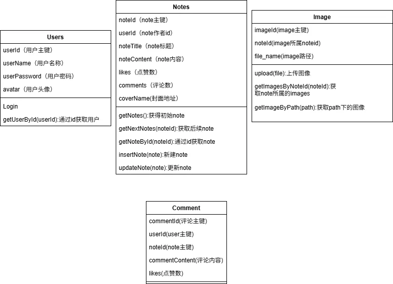

# 问题

* 类的设计目前存在问题:需要将image类进行重构，并把利用的部分进行重新处理
* 数据结构目前不便：需要补充DTO类，以便后续处理

# Design

## 基本数据结构与类图



## 代码架构

```
java
├── data 数据类
│   ├── api 网络接口
│   ├── dao 数据库操作接口(项目弃用)
│   ├── model 数据模型
├── repository 数据仓库
├── ui
│   ├── activity 
│   ├── fragment 
│   ├── adapters 数据adpter
── view 视图


res
├── drawable 图片资源
├── layout 布局文件
├── menu 菜单文件
├── values 资源文件
── xml 
```

# TODO

## Remain

1. 底部导航栏 自定义 “+” 按钮

~~2. recycleView 的loadMore 事件~~

~~3. recycleView 的item 点击事件~~

~~4. recycleView 的item 样式~~

~~5. 头像和图片的接口~~

~~6. note评论区~~

~~7. note获取图片~~

~~8. 新建时的图片上传~~

9. 优化各个界面的流畅度 

## 2025年11月23日
~~1. 底部导航栏  文字样式~~ 添加“+“图标

~~2. 底部导航栏 点击事件 切换 Fragment~~

~~3. 数据表的model类 主页的gridView~~


## 2025年11月30日

~~1. 网络接口的调用~~

~~2. note详情页面~~ （差评论区）

## 2025年12月2日

~~1. NoteDetail界面的顶部 头像和用户名和返回~~

~~2. createNote 界面 进行创建~~

## 2025年12月3日

~~1. createNote 界面 图片上传~~
